# EntityTracker

[](https://github.com/Tosuma/Entity-Dependency-Manager/actions/workflows/ci.yml)
[](docs/DEVELOPMENT.md)
[](global.json)
[](src/EntityTracker.Wpf)
[](LICENSE)

EntityTracker is a Windows desktop application for planning database implementation work in
dependency-safe order. It imports PostgreSQL schema relationships, keeps progress attached to
stable entities, highlights blockers, and turns implementation history into useful progress
reports.

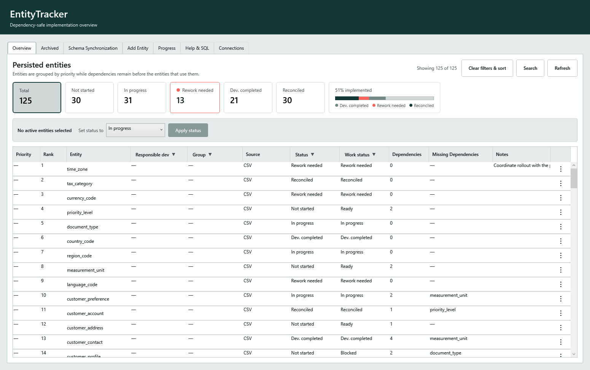

## Why EntityTracker?

Large database schemas are rarely implemented safely in alphabetical order. Tables depend on
other tables, exported schemas may contain unknown references, and re-importing a changing schema
must not erase project-management data.

EntityTracker keeps those concerns separate:

- imported schema facts describe what depends on what;
- manual overrides capture real-world corrections without being lost on the next import;
- stable entity identities retain status, notes, lifecycle, and history;
- ranking and readiness are recalculated from the effective dependency graph;
- unresolved and unfinished dependencies remain visible as actionable blockers.

## Highlights

- **Safe schema synchronization** — preview Complete or Partial PostgreSQL CSV imports before
  applying additions, dependency changes, or archives.
- **Dependency-aware planning** — rank entities so dependencies appear before the entities that
  use them, while preserving unknown references as unresolved dependencies.
- **Manual tracking and correction** — create entities, add or suppress dependencies, update notes
  and progress, and archive or restore entities.
- **Workflow visibility** — combine Excel-style filters on Responsible dev, Group, Status, and
  Work status; sort workflow statuses in their defined order; and search by entity or dependency
  name.
- **Progress reporting** — inspect current status, implementation history, ready-versus-blocked
  trends, and weekly change; copy or export charts as PNG files.
- **Local-first reliability** — SQLite persistence, automatic daily and pre-migration backups,
  rolling logs, and documented recovery procedures.
- **Replaceable core** — Domain, Application, and Reporting remain independent of WPF, SQLite,
  CSV libraries, and future SharePoint infrastructure.

## How it works

1. Run the built-in PostgreSQL extraction query and export its result as a semicolon-delimited CSV.
2. Choose Complete or Partial synchronization and review every actionable difference.
3. Apply the reviewed schema while EntityTracker preserves stable progress, notes, and history.
4. Use dependency-safe rank, readiness, blockers, filters, and search to choose the next work item.
5. Update work status and use the Progress page to communicate delivery trends.

## Screenshots

<!-- Generated with scripts/Generate-ReadmeScreenshots.ps1. See docs/DEVELOPMENT.md. -->

<table>
  <tr>
    <td width="50%">
      <strong>Review schema synchronization</strong><br />
      Compare a complete or partial PostgreSQL snapshot before changing tracked state.<br /><br />
      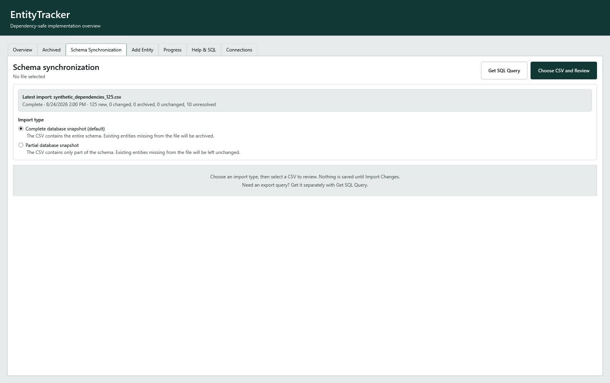
    </td>
    <td width="50%">
      <strong>Track progress over time</strong><br />
      See manager summaries, status distribution, implementation history, and blockers.<br /><br />
      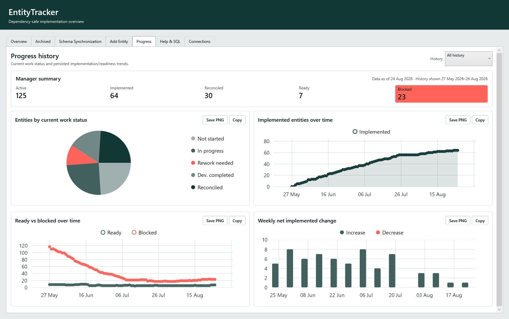
    </td>
  </tr>
  <tr>
    <td width="50%">
      <strong>Create tracked entities</strong><br />
      Add manual entities with resolved or deliberately unresolved dependencies.<br /><br />
      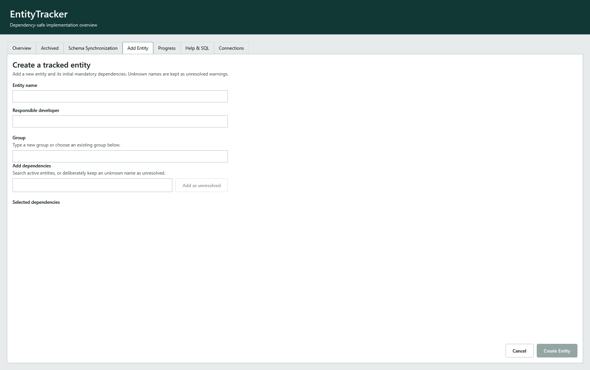
    </td>
    <td width="50%">
      <strong>Edit without losing imported facts</strong><br />
      Update work status, notes, lifecycle, and manual dependency corrections.<br /><br />
      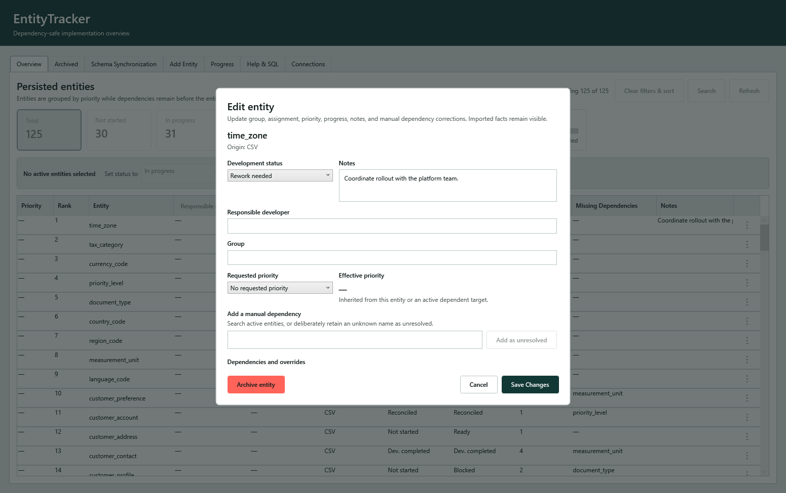
    </td>
  </tr>
</table>

### Find and maintain tracked entities

Use the dropdown on a supported column header to select any combination of responsible developers,
groups, statuses, or work statuses. Selections within a column are alternatives, while filters on
different columns work together. Status summary cards remain useful one-click shortcuts. Search
entity names and, when needed, dependency names from the overview; the same search opens with
<kbd>Ctrl</kbd>+<kbd>F</kbd>.

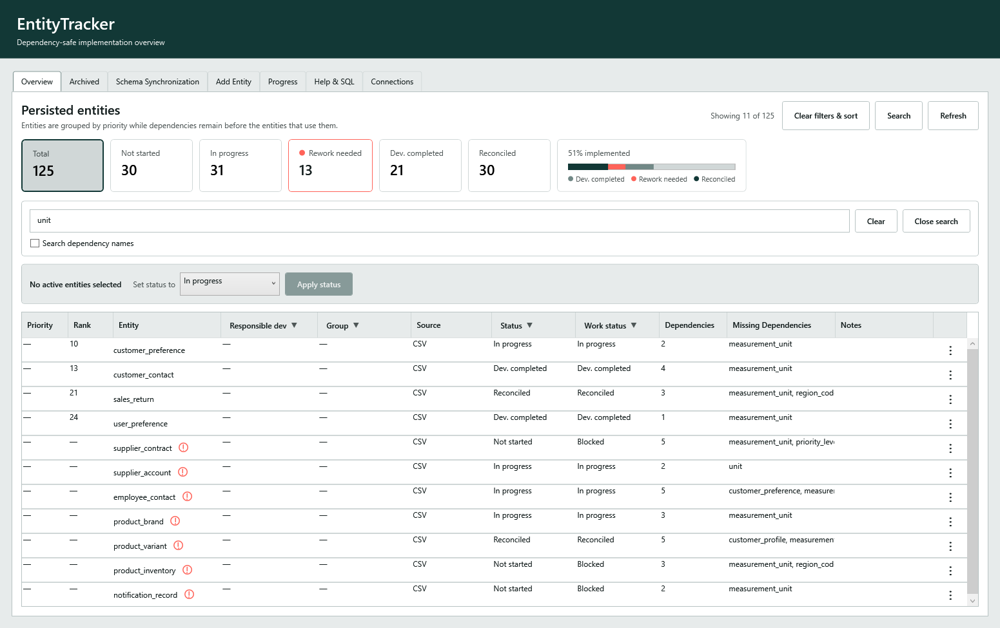

Archived entities have their own tab and independent search, filters, and Status sort. They remain
available as read-only records with their progress, notes, and dependencies intact and can be
deliberately restored from the archived view.

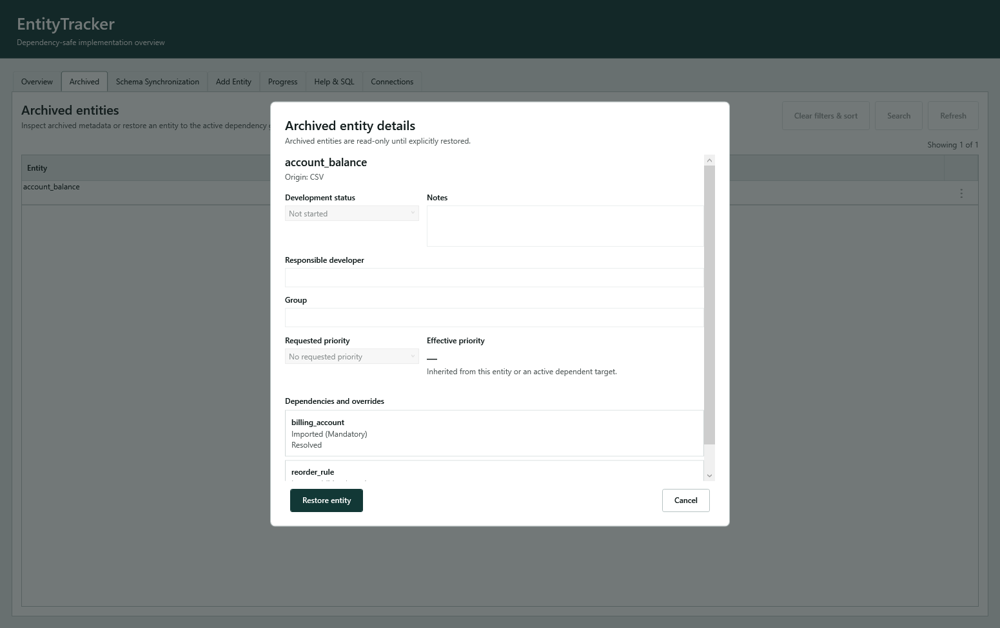

### Understand dependency blockers

Entities with unresolved references—or dependencies that are themselves unresolved—are marked
directly in the overview. Selecting the warning icon explains the graph state and lists the
unresolved names affecting that entity, while the Missing Dependencies column shows outstanding
implementation work.

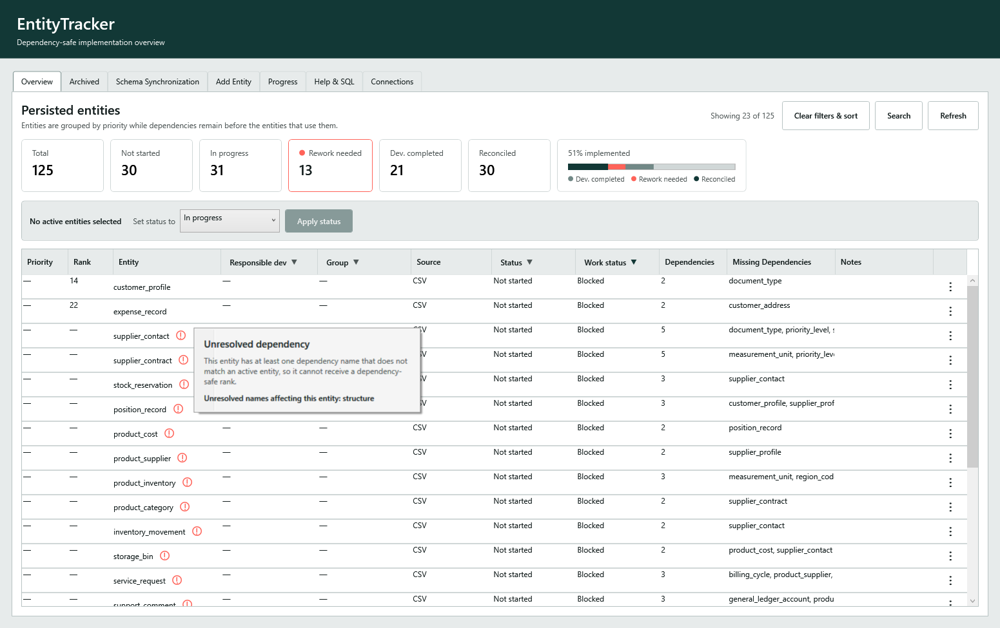

### Import review details

Complete imports make potentially removed entities explicit before anything is saved. Entities
missing from the new snapshot are proposed for soft-archiving, while their progress and notes are
preserved.

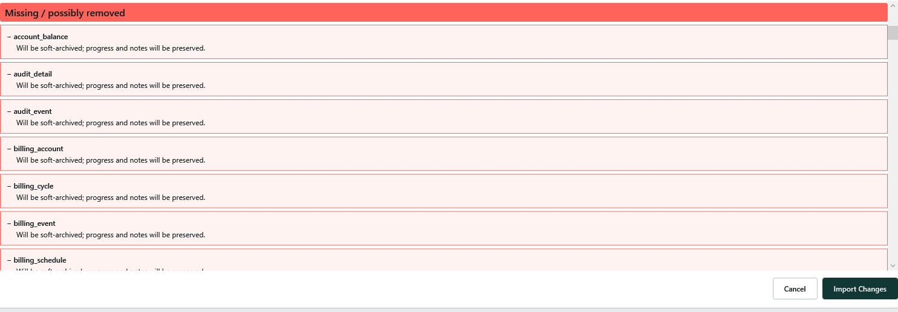

Unknown dependency references do not make an otherwise valid import fail. EntityTracker retains
them as unresolved dependencies, shows exactly which entities are affected, and keeps them blocked
until matching entities become available.

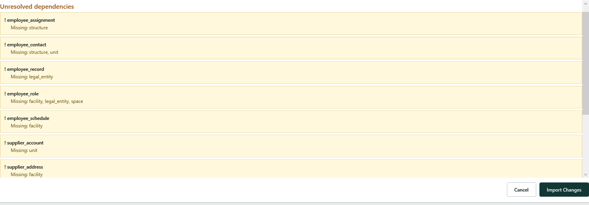

### Extract a PostgreSQL schema

The built-in helper provides the versioned PostgreSQL query used to produce a compatible schema
CSV without requiring a live database connection inside EntityTracker.

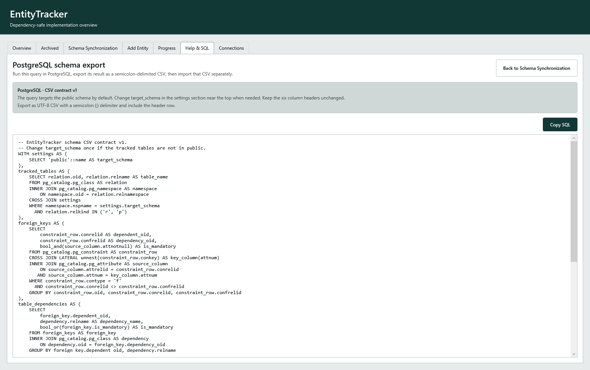

## Project status

Product Milestones 1–12 are complete. EntityTracker currently uses SQLite as its active store. The
Connections page can save non-secret SharePoint setup, but this release does not authenticate,
connect, or synchronize with SharePoint.

Live SharePoint integration is planned in
[Milestone 13](docs/milestones/13_sharepoint_integration.md). A separate
[PF-01–PF-05 product feedback milestone group](docs/milestones/00_README.md#product-feedback-milestones)
plans bulk status updates, customer priority, responsible-developer and group metadata, and
column filtering with status-order sorting without extending the numbered roadmap. The independent
[CI-01 engineering milestone](docs/milestones/ci_01_continuous_integration.md) now validates pull
requests and pushes to `main` and packages successful `main` builds. The live badge above reports
the current `main` build status; CI-01 remains in progress until the `main` package artifact is
verified.

See the [milestone status](docs/milestones/milestone_status.md) and complete
[roadmap](docs/milestones/00_README.md) for details.

## Technology and architecture

EntityTracker targets .NET 10 and uses WPF, SQLite, CsvHelper, and LiveCharts. The solution keeps
dependencies pointing inward:

```text
WPF composition and presentation
              ↓
Infrastructure and Reporting
              ↓
Application use cases
              ↓
Domain model
```

Business rules do not depend on WPF or infrastructure technologies. Read the
[architecture rules](docs/architecture/ARCHITECTURE.md) and
[collaborative storage contract](docs/architecture/COLLABORATIVE_STORAGE.md) for the boundaries and
future SharePoint semantics.

## Getting started

EntityTracker currently runs on Windows and uses the .NET SDK pinned by `global.json`.

The [development guide](docs/DEVELOPMENT.md) contains prerequisites and complete instructions for
cloning, restoring, building, testing, running, publishing, importing a schema, and locating local
application data.

## Documentation

- [Development, build, and run guide](docs/DEVELOPMENT.md)
- [Design and color guide](docs/design/DESIGN_GUIDE.md)
- [PostgreSQL schema CSV contract](docs/importing/schema-csv-contract-v1.md)
- [Local backup, logs, and recovery](docs/operations/RECOVERY.md)
- [Architecture rules](docs/architecture/ARCHITECTURE.md)
- [Roadmap and milestones](docs/milestones/00_README.md)

## Contributing

Contributions are welcome. Start with [CONTRIBUTING.md](CONTRIBUTING.md), which explains the
required verification commands and the architectural constraints that keep the core independent
of UI and storage technologies.

## License

EntityTracker is available under the [MIT License](LICENSE).
